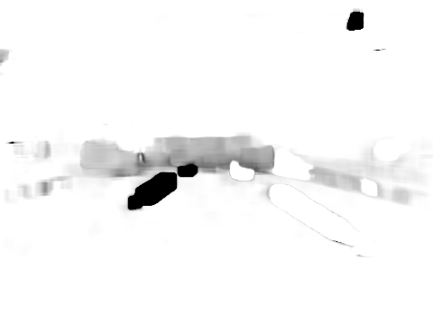

## Overview

The goal is to predict the speed of car from dashcam footage.

From [Comma-AI's Speed Challenge](https://github.com/commaai/speedchallenge)
```
* data/train.mp4 is a video of driving containing 20400 frames. Video is shot at 20 fps.
* data/train.txt contains the speed of the car at each frame, one speed on each line.
* data/test.mp4 is a different driving video containing 10798 frames. Video is shot at 20 fps.
```
## Evaluation
- Using mean squared error (mse) to evaluate accuracy of my LSTM model (**goal: <10 mse**)


