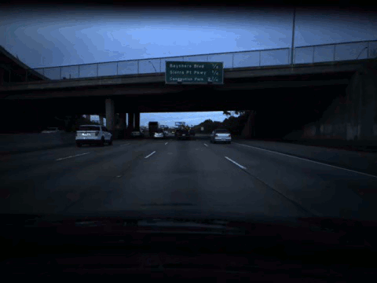

## Overview

The goal is to predict the speed of car from dashcam footage.

From [Comma-AI's Speed Challenge](https://github.com/commaai/speedchallenge)
```
* data/train.mp4 is a video of driving containing 20400 frames. Video is shot at 20 fps.
* data/train.txt contains the speed of the car at each frame, one speed on each line.
* data/test.mp4 is a different driving video containing 10798 frames. Video is shot at 20 fps.
```
## Evaluation
- Using mean squared error (mse) to evaluate accuracy of my LSTM model (**goal: <10 mse**)


## Project workflow

### Preparing Training set data with video
I started with the train.mp4 video, I split this up into individual frames so I could train my LSTM model

<p align="center">
  
</p>


### Optical Flow
I used optical flow to track the motion detected from frame to frame. My plan was to combine the optical flow matrix with the segmentation matrix. That way, the model would be able to use distinct objects as a reference for movement in the frame. 

<p align="center">
  
</p>

