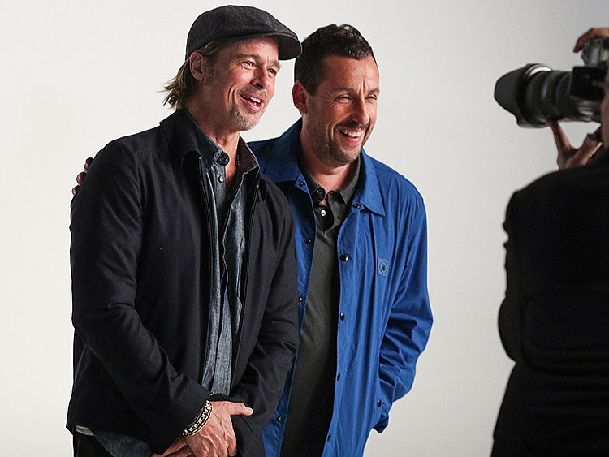
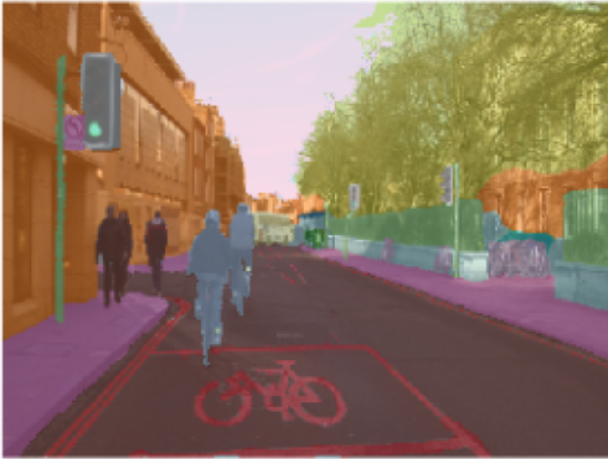
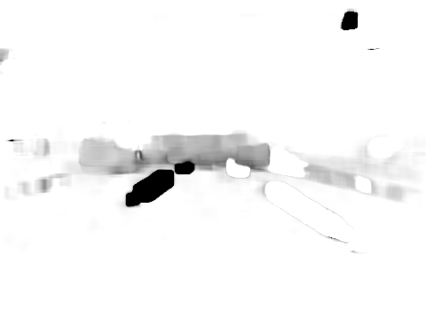

## Project Overview 

#### Project Workflow 

[ Insert image of the overall workflow ]

## Preparing the dataset
#### Segmentation 

After separating the video into 20,400 images I decided to run each image
through segmentation. 

Segmentation is a form of image classification. A typical image classifier has 
a set number of classes. For example we can make a binary classifier that 
distinguishes between Adam Sandler or Brad Pitt. 

But what if the image contains both Brad Pitt and Adam Sandler? How should the
image classifier categorize the image? Segmentation is a way to work around
this problem. This technique anticipates that both our classes ( Brad Pitt and
Adam Sandler ) may be in an image at the same time and therefore approaches
classification differently. Instead of classifying an image as Brad or Adam,
segmentation classifies each pixel as Adam or Brad. 

In the context of our speed detection problem we categorized everything in the
image of the dash cam footage. We used 31 classes to categorize everything from
buildings ( shown in orange ), to lane markings ( shown in red ). We see all
the separate classes as distinct colors but the computer sees the image as a
matrix of numbers. Since we have 31 categories all numbers in the matrix are
from 0 to 30 ( e.g., lane markings are all labeled as 4 ).

Segmenting all our images will allow us to implement other techniques that will
help us detect the speed at each frame. 

In the following steps we take our image set and process in two separate ways
( optical flow and one-hot encoding ), later we will combine both image sets
again. 

#### Optical Flow 
<table>
<tr> <td> </td><td></td></tr>
</table>

Optical flow is a computer vision tool used for sequential data. In our case
we're using it to track any movement from image to image. This allows us to see
which of our classes ( pedestrians, street signs ) are moving through 
our sequence of images. 

Let's imagine again our image as a matrix. Our matrix has dimensions of 20 x
30. Optical flow uses small filters ( i.e., a smaller matrix, usually 3 x 3 or
    5 x 5 ) that hovers over every part of the 20 x 30 matrix and identifies
small dense clusters of similar pixels and then compares it to the next
matrix in the sequence. 

Visually this ends up looking like the image above on the right, only movement is
tracked. Comparing the optical flow gif to the video frame gif on the left we
can see that lane markings are being picked up by the optical flow model!
That's great news for us because we want to give our LSTM model an object to
reference so that it can develop a speed estimate for each frame. 

For more information and an implementation of optical flow check [this](
https://opencv-python-tutroals.readthedocs.io/en/latest/py_tutorials/py_video/py_lucas_kanade/py_lucas_kanade.html
) out.

