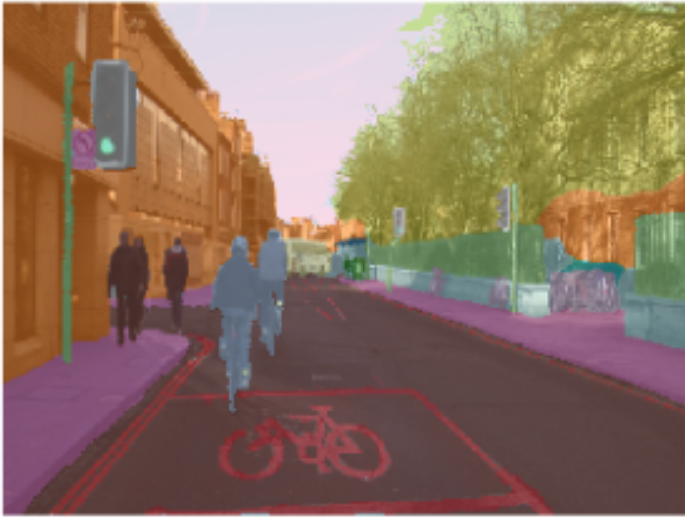

## Overview

The goal is to predict the speed of car from dashcam footage.

From [Comma-AI's Speed Challenge](https://github.com/commaai/speedchallenge)
```
* data/train.mp4 is a video of driving containing 20400 frames. Video is shot at 20 fps.
* data/train.txt contains the speed of the car at each frame, one speed on each line.
* data/test.mp4 is a different driving video containing 10798 frames. Video is shot at 20 fps.
```
## Evaluation
- Using mean squared error (mse) to evaluate accuracy of my LSTM model (**goal: <10 mse**)


## Project workflow

### Preparing Training set data with video
I started with the train.mp4 video, I split this up into individual frames/images so I could manipulate and prepare each one. I started by converting the images to matrices.

<p align="center">
  
</p>


### Optical Flow
I used optical flow to track the motion detected from frame to frame. My plan was to combine the optical flow matrix with the segmentation matrix. That way, the model would be able to use distinct objects as a reference for movement in the frame. 

<p align="center">
  
</p>


### Segmentation 
Segmentation is a form of image classification but at the pixel level. E.g., Is this pixel part of a sidewalk or lane markings? The pixel is then catagorized by color.

There are 31 potential object categories, though not all objects appear throughout the video. 

<p align="center">
  
</p>
<p aligh="center">This image is from fasi.ai's segmentation lecture.</p>


### One-hot encoding, combining one-hot matrix with optical flow
Both optical flow images and segmentation images were converted into matrices. One-hot encoding was a way to prepare segmentation matrices. If one of the 31 segmentation categories appeared in the image there'd be a 1 or 1's. Other categories had 0 if were not spotted. 

This preparation helped identify which objects were moving throughout the image. More importantly the LSTM model would be able to identify areas that would allow it to predict speeds at each frame. 


### Long Term Short Memory (LSTM) Model 


